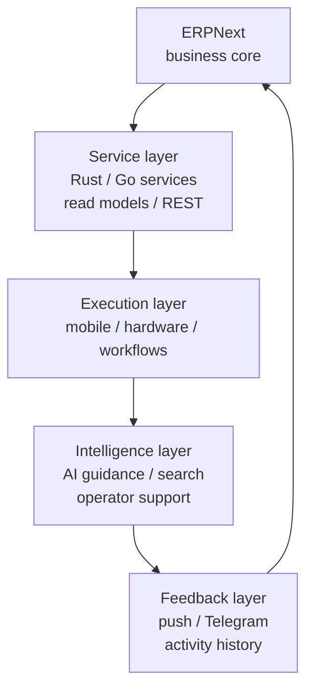

<h1 align="center">Abdulfattox</h1>

<strong>ERPNext ecosystem engineer building mobile, hardware, backend, and service layers around real operations.</strong>

  <code>ERPNext</code>
  <code>Rust</code>
  <code>Go</code>
  <code>Flutter</code>
  <code>MariaDB</code>
  <code>Industrial Hardware</code>
  <code>AI Assistance</code>

> I work toward one idea: ERPNext should not stay as a desk-only system. It can
> grow into a connected operational ecosystem where mobile apps, hardware,
> services, automation, and AI all take root around the same business core.

## Identity

I see myself as a research-minded architect and a modest builder. I am not
interested in presenting myself through claims or titles first. The work should
be visible enough for others to judge it directly.

My focus is ERPNext as a living operational core. Around that core, I build the
layers that make the system useful outside the office: mobile execution,
warehouse flows, supplier/customer workflows, scale and printer integrations,
read-optimized services, notification loops, and AI-assisted guidance.

The direction is simple: keep the business system powerful, but make the
operator's action small, clear, and reliable.

## Working Philosophy

The systems I want to build may be complex internally, but that complexity
should not be pushed onto the user. A good operational system can collect rich
business data, preserve context, and coordinate many moving parts while the
operator performs only a minimal, understandable action.

In practice, that means:

- ERPNext remains the source of business truth.
- Services hide unnecessary ERP complexity from field users.
- Mobile screens focus on execution, not explanation.
- Hardware becomes part of the workflow, not an external accessory.
- Search and filtering support less technical users instead of punishing them.
- AI helps explain, guide, and reduce confusion when the workflow becomes hard.

## Organization

I maintain [`accord-erp-automation`](https://github.com/accord-erp-automation)
as the production home for my ERPNext ecosystem work.

The organization collects the systems that are no longer just experiments:
mobile backends, Flutter clients, ERPNext custom fields, read-optimized
services, scale/Zebra integrations, and workflow automation around real
warehouse and delivery operations.

Its purpose is to keep the ecosystem organized: one place for production-grade
ERPNext services, release-ready components, tested backend work, and
field-oriented operational tools.

## Current Production Proof

The clearest current proof of this direction lives under
[`accord-erp-automation`](https://github.com/accord-erp-automation).

| System | Stack | What it proves |
| --- | --- | --- |
| [`accord_mobile_server_rs`](https://github.com/accord-erp-automation/accord_mobile_server_rs) | Rust, Axum, Tokio, SQLx, LMDB | A production mobile backend can preserve ERPNext behavior while using fast read models, stable local state, push notifications, and clean service boundaries. |
| [`accord_mobile`](https://github.com/accord-erp-automation/accord_mobile) | Flutter, Dart | ERPNext workflows can become mobile-first execution paths for supplier, customer, Werka, warehouse, delivery, and admin users. |
| [`accord_erp_custom_field`](https://github.com/accord-erp-automation/accord_erp_custom_field) | Python, Frappe | ERPNext can be extended with structured fields that make bridge services more precise, searchable, and operationally useful. |

Current public release:

- [`accord_mobile_server_rs v1.1.0`](https://github.com/accord-erp-automation/accord_mobile_server_rs/releases/tag/v1.1.0)

## Ecosystem Shape

## Engineering Rules I Respect

### Preserve business meaning first

Speed is useful only when the result still means the same thing. Read paths can
be optimized, cached, or projected, but business mutations should stay inside
ERPNext's document lifecycle unless there is a very clear reason to change
that boundary.

### Build for the least-trained operator

Industrial software should not assume perfect users. If the least-trained
person in the workflow can complete the task confidently, the system is moving
in the right direction.

### Make complexity serve simplicity

The system can be complex internally: indexes, services, state stores, API
contracts, device protocols, and database projections. The user should not have
to carry that complexity. The interface should stay simple while the system
records the deeper operational context.

### Let the work speak

I prefer measured systems, clear architecture, and working releases over
self-description. Criticism is useful when it exposes the next thing that needs
to become better.

## Earlier Public Research

Before the current Accord production organization, I explored the same direction
through smaller public projects under this account.

| Domain | Repositories | Role |
| --- | --- | --- |
| ERPNext mobile bridge | [`erpnext-mobile-bridge`](https://github.com/WIKKIwk/erpnext-mobile-bridge), [`erpnext-mobile-client`](https://github.com/WIKKIwk/erpnext-mobile-client), [`erpnext-bridge-fields`](https://github.com/WIKKIwk/erpnext-bridge-fields) | Early bridge and mobile execution work around ERPNext. |
| Hardware operations | [`zebra-scale-erpnext-core`](https://github.com/WIKKIwk/zebra-scale-erpnext-core), [`rfid-zebra-scale-hybrid-core`](https://github.com/WIKKIwk/rfid-zebra-scale-hybrid-core), [`zebra-rfid-bridge-core`](https://github.com/WIKKIwk/zebra-rfid-bridge-core) | Experiments around Zebra, RFID, weighing, and ERP-connected device workflows. |
| Messaging systems | [`erpnext-stock-telegram-core`](https://github.com/WIKKIwk/erpnext-stock-telegram-core), [`erpnext-stock-telegram-bot`](https://github.com/WIKKIwk/erpnext-stock-telegram-bot), [`erpnext-assignment-telegram-bot`](https://github.com/WIKKIwk/erpnext-assignment-telegram-bot) | Telegram as an operational control surface for stock, assignment, and feedback. |
| ERPNext modules | [`erpnext-ui-theme-suite`](https://github.com/WIKKIwk/erpnext-ui-theme-suite), [`erpnext-security-suite`](https://github.com/WIKKIwk/erpnext-security-suite), [`erpnext-backup-orchestrator`](https://github.com/WIKKIwk/erpnext-backup-orchestrator) | UI, safety, backup, and operational hardening experiments for ERPNext. |
| AI guidance | [`erpnext-guided-ai-assistant`](https://github.com/WIKKIwk/erpnext-guided-ai-assistant), [`erpnext-admin-ai-assistant`](https://github.com/WIKKIwk/erpnext-admin-ai-assistant), [`expert-answer-ai-agent`](https://github.com/WIKKIwk/expert-answer-ai-agent) | AI assistance for explanation, troubleshooting, expert answers, and ERPNext support. |

## Direction

| Direction | Intent |
| --- | --- |
| ERPNext as an ecosystem | Grow ERPNext beyond desk usage into mobile, hardware, automation, and service layers. |
| Mobile-first operations | Make real warehouse, supplier, customer, delivery, and admin workflows executable from the field. |
| Hardware-aware software | Treat scales, printers, RFID, and scanners as active parts of the business process. |
| AI-assisted clarity | Use AI to guide, explain, search, and reduce confusion inside operational workflows. |
| Productized boundaries | Turn experiments into maintainable services with clear ownership, release notes, tests, and deployment rules. |

## More

- Organization: [`accord-erp-automation`](https://github.com/accord-erp-automation)
- Profile website: [`abdulfattox-web`](https://github.com/WIKKIwk/abdulfattox-web)
- Personal note: [`ABOUT_ME.md`](./ABOUT_ME.md)
